### Escuela Colombiana de Ingeniería
### Arquitecturas de Software - ARSW

## Escalamiento en Azure con Maquinas Virtuales, Sacale Sets y Service Plans

## Desarrollado por:

+ José Manuel Gamboa Gómez
+ Zuly Valentina Vargas Ramírez

### Dependencias
* Cree una cuenta gratuita dentro de Azure. Para hacerlo puede guiarse de esta [documentación](https://azure.microsoft.com/es-es/free/students/). Al hacerlo usted contará con $100 USD para gastar durante 12 meses.
Antes de iniciar con el laboratorio, revise la siguiente documentación sobre las [Azure Functions](https://www.c-sharpcorner.com/article/an-overview-of-azure-functions/)

### Parte 0 - Entendiendo el escenario de calidad

Adjunto a este laboratorio usted podrá encontrar una aplicación totalmente desarrollada que tiene como objetivo calcular el enésimo valor de la secuencia de Fibonnaci.

**Escalabilidad**
Cuando un conjunto de usuarios consulta un enésimo número (superior a 1000000) de la secuencia de Fibonacci de forma concurrente y el sistema se encuentra bajo condiciones normales de operación, todas las peticiones deben ser respondidas y el consumo de CPU del sistema no puede superar el 70%.

### Escalabilidad Serverless (Functions)

1. Cree una Function App tal cual como se muestra en las  imagenes.

Creación:
Se crea la Function App con las indicaciones dadas:

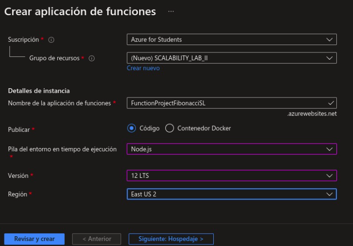

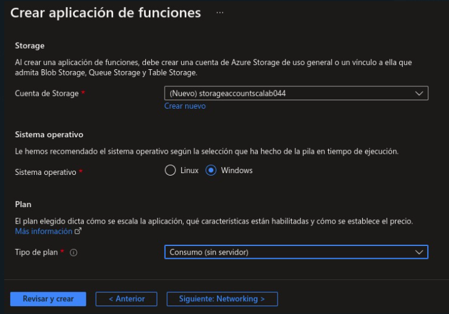

2. Instale la extensión de **Azure Functions** para Visual Studio Code.

Se busca la extensión y se instala:

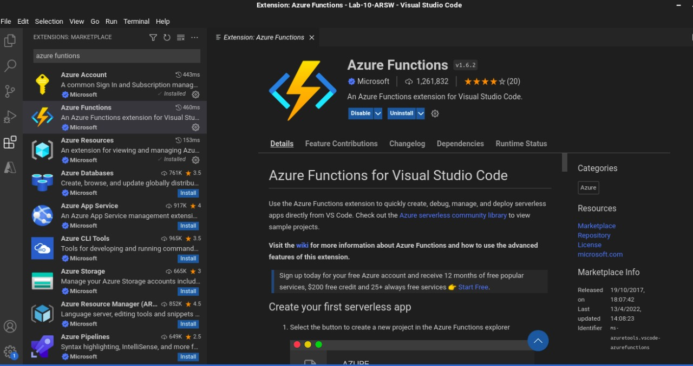

3. Despliegue la Function de Fibonacci a Azure usando Visual Studio Code. La primera vez que lo haga se le va a pedir autenticarse, siga las instrucciones.

Se despliega la aplicación haciendo uso de la extensión. Se selecciona la app correspondiente:

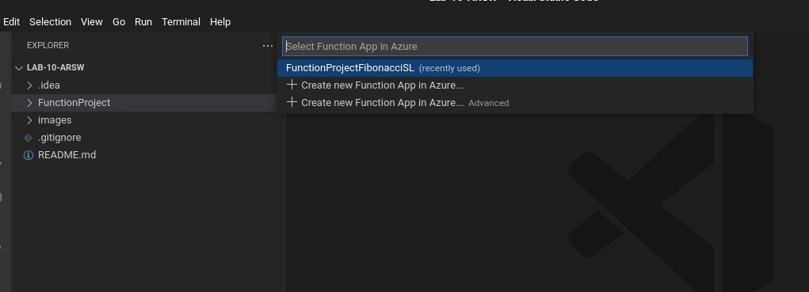

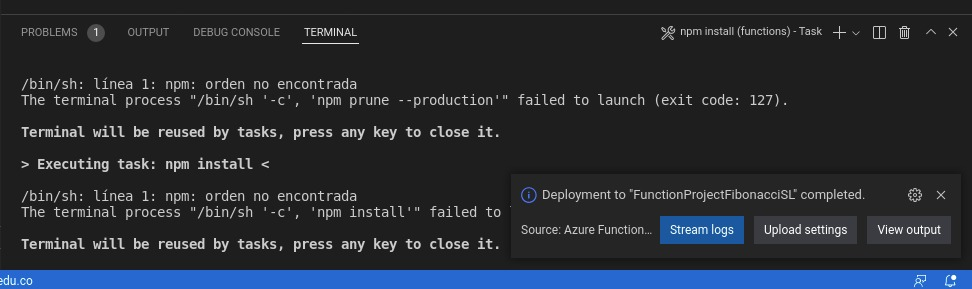

4. Dirijase al portal de Azure y pruebe la function.

Para solucionar los problemas del despliegue se instaló node y npm. Luego con npm se realizó la instalación de "big-integer" ya que Azure no reconoce este módulo. Una vez realizados estos pasos ubicados en la carpeta donde se encuentra la aplicación, localmente ejecutamos el comando npm install. Finalmente se despliega la aplicación en Azure. Ahora, desde Azure comprobamos que la ejecución se realizó correctamente:

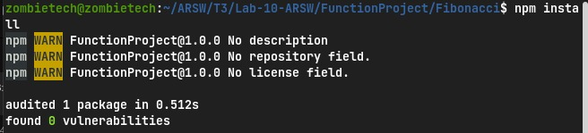

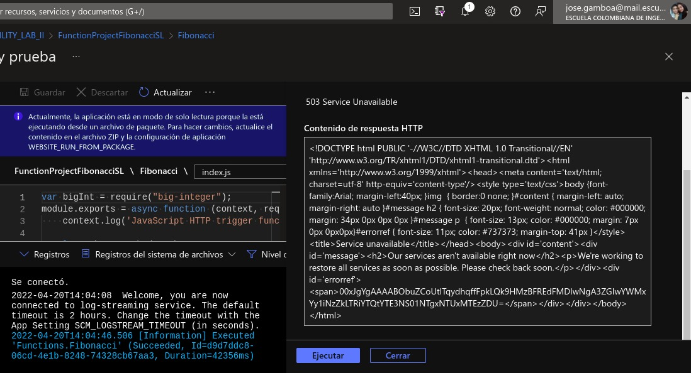

5. Modifique la coleción de POSTMAN con NEWMAN de tal forma que pueda enviar 10 peticiones concurrentes. Verifique los resultados y presente un informe.

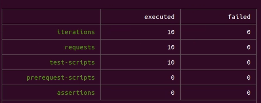

Recuento de peticiones:

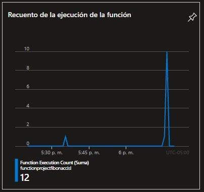

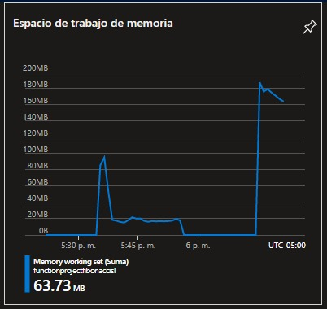

6. Cree una nueva Function que resuelva el problema de Fibonacci pero esta vez utilice un enfoque recursivo con memorización. Pruebe la función varias veces, después no haga nada por al menos 5 minutos. Pruebe la función de nuevo con los valores anteriores. ¿Cuál es el comportamiento?.

Implementamos la memorización con un diccionario que permite ir guardando los valores que se van calculando en el proceso y recursividad mediante la fórmula implementada en una nueva función, desplegamos esta nueva versión de la función en Azure:

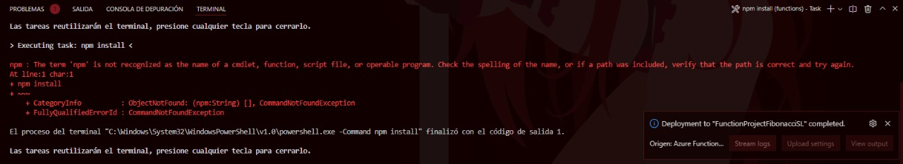

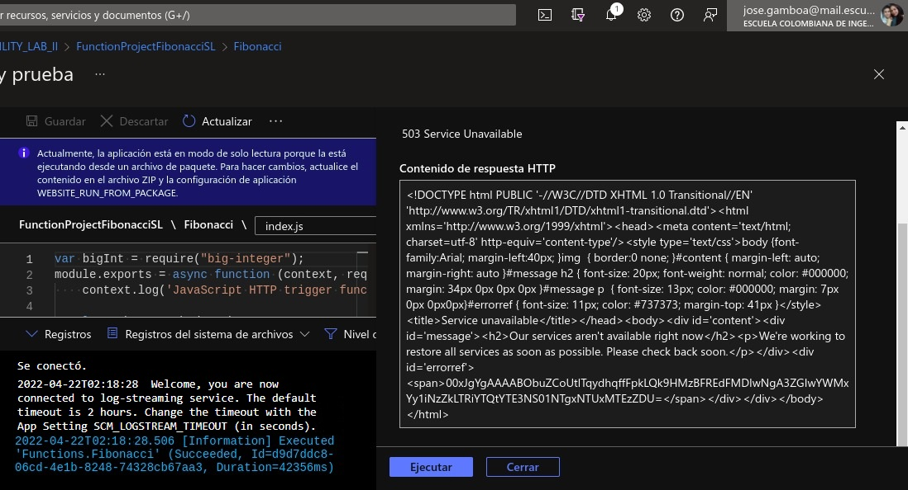

Realizamos nuevamente 10 peticiones y verificamos el espacio de trabajo de memoria:

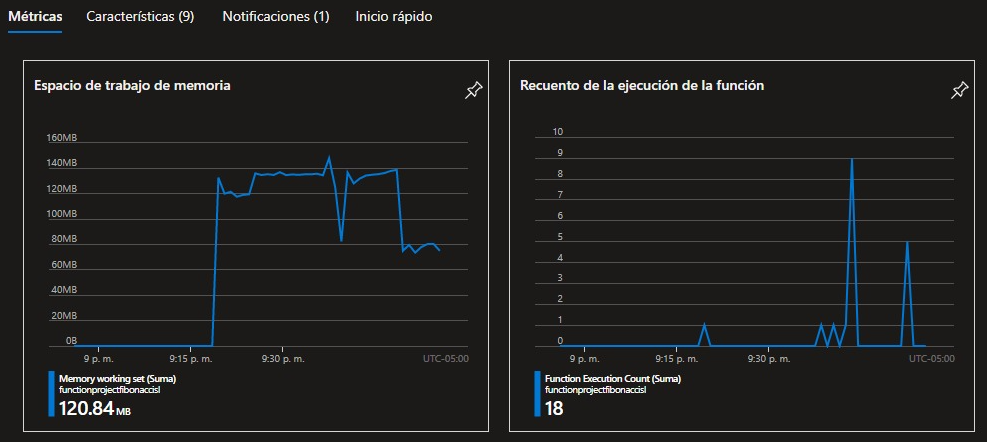

En esta ocasión los tiempos de respuesta disminuyeron. Sin embargo, por problemas con la memorización algunas de las consultas realizadas fallaron.

**Preguntas**

* ¿Qué es un Azure Function?

Azure Function es una solución en la nube de Azure que permite ejecutar y mantener en funcionamiento aplicaciones sin necesidad de configurar la infraestructura necesaria. De igual manera, Azure Function proporciona tantos o tan pocos recursos de cómputo como sea necesario para satisfacer la demanda de la aplicación.

* ¿Qué es serverless?

Serverless hace referencia a "Sin servidor", que en este contexto sería "Computación sin servidor".Este es un modelo de ejecución en el que el proveedor en la nube (AWS, Azure etc) es responsable de ejecutar un fragmento de código mediante la asignación dinámica de los recursos necesarios, además cobrando solo por la cantidad de recursos utilizados para ejecutar el código. El código, generalmente, se ejecuta dentro de contenedores sin estado que pueden ser activados por una variedad de eventos que incluyen solicitudes HTTP, eventos de base de datos, servicios de colas, alertas de monitoreo, carga de archivos, eventos programados (trabajos cron), etc. 

* ¿Qué es el runtime y que implica seleccionarlo al momento de crear el Function App?

El runtime carga todas las aplicaciones de un programa y las ejecuta en una plataforma. Además proporciona funciones básicas para la memoria, las redes y el hardware necesario para la ejecución de la función. El entorno de ejecución ejecuta estas funciones independientemente del sistema operativo.

* ¿Por qué es necesario crear un Storage Account de la mano de un Function App?

El Storage Account proporciona un espacio de nombres único para los datos de almacenamiento de Azure que es accesible desde cualquier parte a través de HTTP o HTTPS. Los datos en el Storage Account son duraderos y altamente disponibles, seguros y escalables de forma masiva. Para el uso de Function App es necesario para las operaciones de almacenamiento y administracion que realizan en la ejecución de las diferentes funciones.

* ¿Cuáles son los tipos de planes para un Function App?, ¿En qué se diferencias?, mencione ventajas y desventajas de cada uno de ellos.

Existen 3 diferentes planes para un Function App:

+ Plan de consumo Escale de forma automática y pague los recursos de proceso solo cuando se ejecuten las funciones.
En el plan de consumo, las instancias del host de Functions se agregan y quitan de forma dinámica según el número de eventos de entrada.
    * Plan de hospedaje predeterminado.
    * Pague solo cuando se ejecutan las funciones.
    * Escala de forma automática, incluso durante períodos de carga elevada.

+ Plan Premium
Escala automáticamente en función de la demanda mediante trabajos preparados previamente que ejecutan aplicaciones sin ningún retraso después de estar inactivas, ejecuta en instancias más eficaces y se conecta a redes virtuales.
Considere la posibilidad de elegir el plan Premium de Azure Functions en las siguientes situaciones:
    * La aplicación de funciones se ejecuta de forma continua, o casi continua.
    * Tiene un gran número de ejecuciones pequeñas y una factura de ejecución elevada, pero pocos GB por segundo en el plan de consumo.
    * Necesita más opciones de CPU o memoria de las que proporciona el plan de consumo.
    * Su código debe ejecutarse durante más tiempo del máximo permitido en el plan de consumo.
    * Necesita características que no están disponibles en el plan de consumo, como la conectividad con red virtual.

+ Plan Dedicado
Ejecute las funciones en un plan de App Service a los Precios de App Service normales. Mejor para escenarios de ejecución prolongada en los que no se puede usar Durable Functions. Considere el plan de App Service en las situaciones siguientes:
    * Tiene máquinas virtuales infrautilizadas que ya ejecutan otras instancias de App Service.
    * Quiere proporcionar una imagen personalizada en la que ejecutar sus funciones.
    * Se requieren escalado y costos predictivos.

* ¿Por qué la memorización falla o no funciona de forma correcta?

Debido al mecánismo de recursividad implementado, los valores que se van buscando se van almacenando para facilitar y optimizar futuras busquedas sin embargo debido a que los números ingresados en las diferentes consultas son muy grandes esto hace que la memoria se consuma con rápidez lo que impide que la función funcione correctamente.

* ¿Cómo funciona el sistema de facturación de las Function App?
Functions se factura según el consumo de recursos observado, medido en gigabytes por segundos (GB-s). El consumo de recursos observado se calcula multiplicando el tamaño medio de memoria en GB por el tiempo en milisegundos que dura la ejecución de la función. La memoria que una función utiliza se mide redondeando al alza a los 128 MB más cercanos hasta un tamaño de memoria máximo de 1.536 MB, y el tiempo de ejecución se redondea al alza a los 1 ms más cercanos. Para la ejecución de una única función, el tiempo de ejecución mínimo es de 100 ms y la memoria mínima es de 128 MB, respectivamente. Los precios de Functions incluyen una concesión gratuita al mes de 400.000 GB-segundos.

* Informe

El desarrollo del laboratorio se puede observar en el paso a paso dado en las indicaciones. 